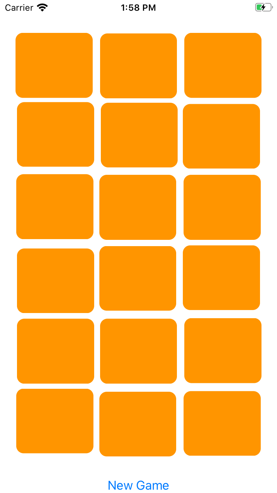
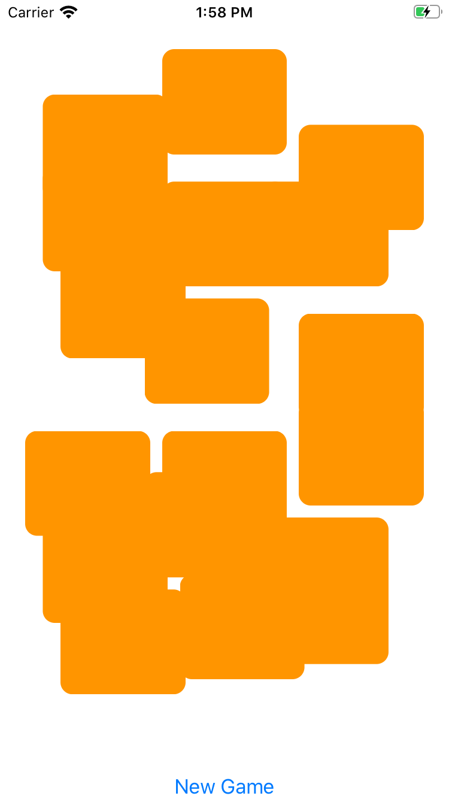
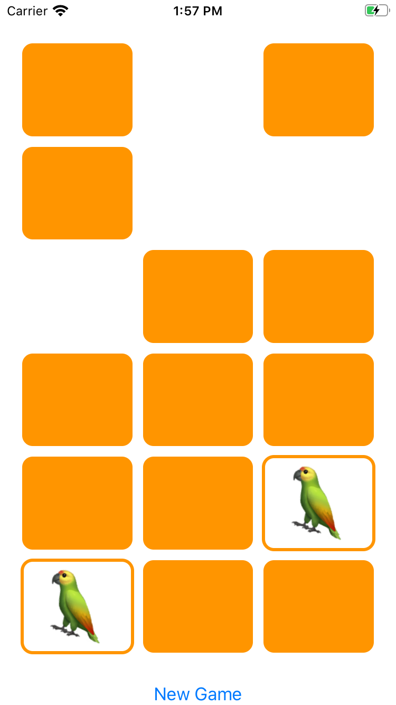
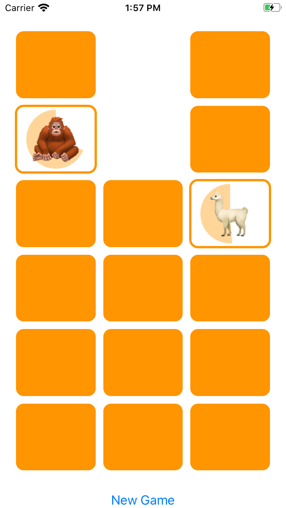

# Memorize

[]() 
[]() 
[]() 
[]()

Stanford cs193p Memorize game implemented in SwiftUI


## Installing / Getting started

Just open and run on Xcode

I've used Xcode 11.7 and an iPhoneX to run this project.

## Developing

### Languages
Swift Language and SwiftUI for the GUI. 

### Built With

I've developed this simple project with the **MVI (Model-View-Intent)** pattern in mind.

MVI is a pattern that goes well with reactive programming and that matches SwiftUI to perfection.

#### Model - MemoryGame.Swift
Our Model is a simple array of cards. Card is an identifiable and generic Struct that represents a card with an emoticon/text/image/PutYourTypeHere 
associated to it.

When the fabric creates a card with an specific emoticon/text/type, the matching pair of that card is also created in the model.

The model is also place to several calculations and properties. The special one is the animatedBonusRemaining that is being tracked in our view using the
@State property wrapper and is used in model calculations to animate the UI once the model/this property changes (remember the MVI stuff?).

  ```swift
  @State private var animatedBonusRemaining : Double = 0
  ```

#### Views - EmojiMemoryGameView.Swift

  View that uses GridLayout.Swift (implemented by professor Paul Hegarty) to show memory game cards pairs of cards. 
  
  Cards start initially facing back, and once the user express the intent to try a match they turn faceUp. If a match occurs, a nice animation is shown and the pair of matched cards is gone.
  In this view we use @ObservedObject to manage state of our ViewModel
  
  ```swift
  @ObservedObject var vmEmojiMemoryGame: EmojiMemoryGame
  ```
 

#### ViewModel -EmojiMemoryGame.Swift

In our viewModel we use @Published property wrapper on our Model variable.  That way, our viewModel is tracking model changes and updating the view accordingly.

```swift
@Published private var game : MemoryGame<String> = EmojiMemoryGame.createMemoryGame()
```

The view model also lists the intents of our user, and that's just two of them: to choose a card (and try a match) and to reset the game.

## Screenshots

* **Start a game**

  * The grid layout of cards start organized in perfect rows and cols. When the user intents to start a new game, we scramble our cards.
  
  
  
  
  
 
* **Matching**

  * When the user intents to chose a card and goes for a match, a nice animation that rotates the matched cards is shown and the user scores points. If a match does not occur, the user wastes time for a bonus quick match score! The time to gain bonus is represented by the animated time pie behind the emoticon text.
  
  
  
  


## Licensing

MIT
